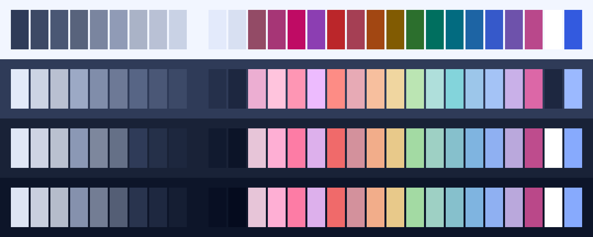

<h3 align="center">
	<br/>
	
	Blueberry for <a href="https://github.com/tinted-theming/base24">Base24</a>
	
</h3>

<p align="center">
	<a href="https://github.com/shythulu/DarkBerry/stargazers"></a>
	<a href="https://github.com/shythulu/DarkBerry/issues"></a>
	<a href="https://github.com/shythulu/DarkBerry/contributors"></a>
</p>

<p align="center">
	<a href="../">🫐 </a>
	<a href="../lingonberry/">🍒 </a>
	<a href="../cloudberry/">🍊 </a>
	<a href="../crowberry/">🍇 </a>
	💙 
</p>

<p align="center">
	
</p>

## Previews

<details>
<summary>🕯️ Wisp</summary>

</details>
<details>
<summary>🌾 Fen</summary>

</details>
<details>
<summary>🪦 Mire</summary>

</details>
<details>
<summary>🌑 Blackwater</summary>

</details>

## Usage

Darkberry as a [Tinted Theming](https://github.com/tinted-theming) scheme. Tinted
Theming's builders turn one scheme file into config for seventy-odd applications.

1. Copy a flavour from this folder into a builder's schemes directory.
2. Build:

   ```sh
   tinty install                      # or: tinted-builder-rust build .
   ```

Base24 is the format most templates understand. It has twenty-four fixed slots, `base00`
to `base17`, and every Base16 and Base24 template reads them. The catch is that each slot
means two things at once, an editor colour and an ANSI colour, and Darkberry does not
always want the same colour for both. Where they clash, the file keeps the ANSI meaning,
so a terminal built from it matches the kitty, Ghostty and Konsole ports. Where the spec
names a slot for legibility, it keeps the legible colour instead. The header comment in
each file lists the slots that had to compromise and why. If your template supports it,
the [Tinted8](../tinted8) port is the more faithful of the two.

All four flavours were built with `tinted-builder-rust` 0.21.0, which rejects unknown
fields, and every value was rendered back out and compared against the source.

## 💝 Thanks to

- [shythulu](https://github.com/shythulu)

&nbsp;

<p align="center">
	
</p>

<p align="center">
	Copyright &copy; 2026-present <a href="https://github.com/shythulu/DarkBerry" target="_blank">shythulu</a>
</p>

<p align="center">
	<a href="https://github.com/shythulu/DarkBerry/blob/main/LICENSE"></a>
</p>
