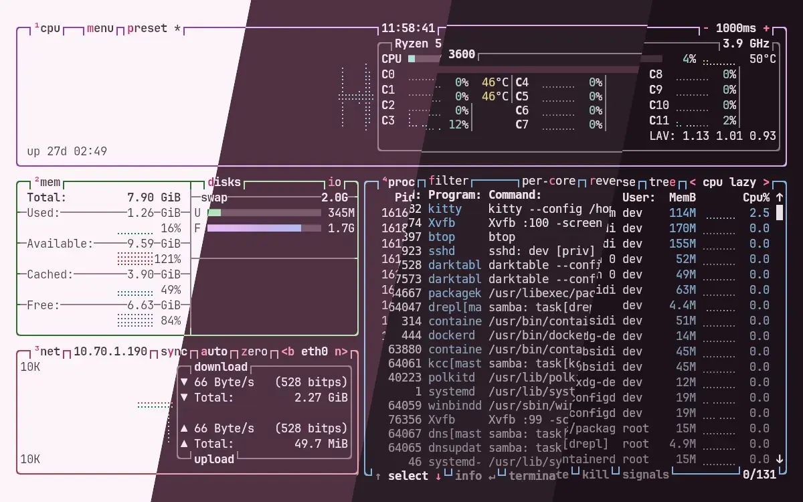
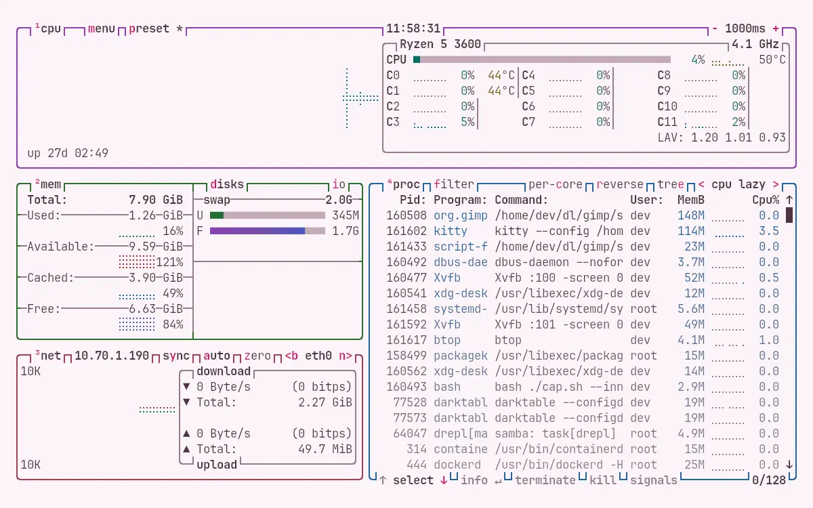
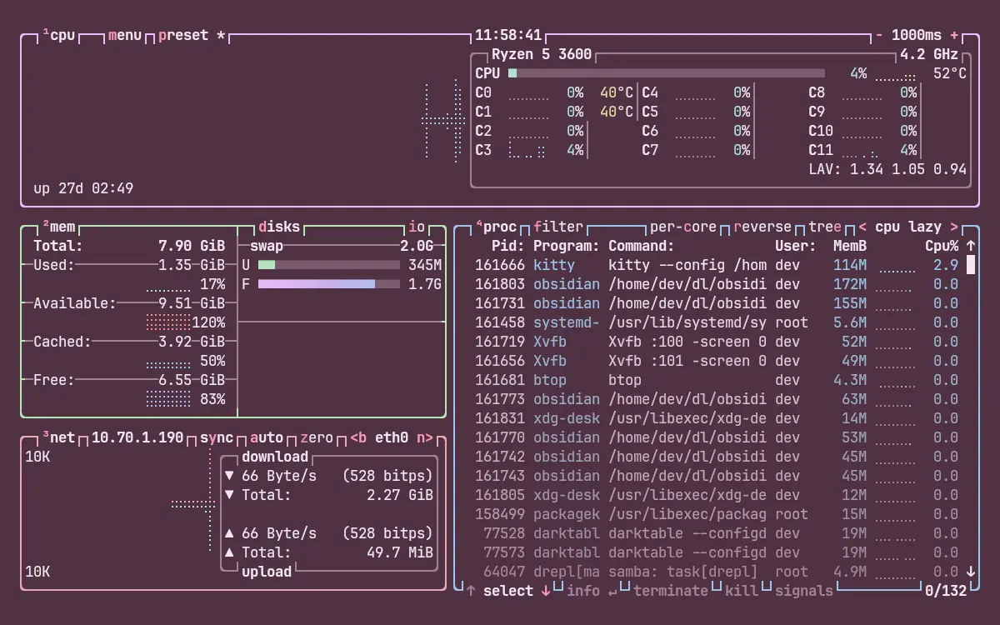
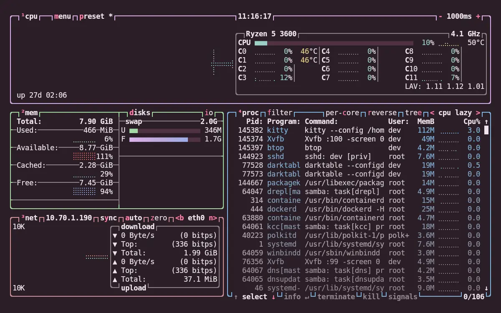
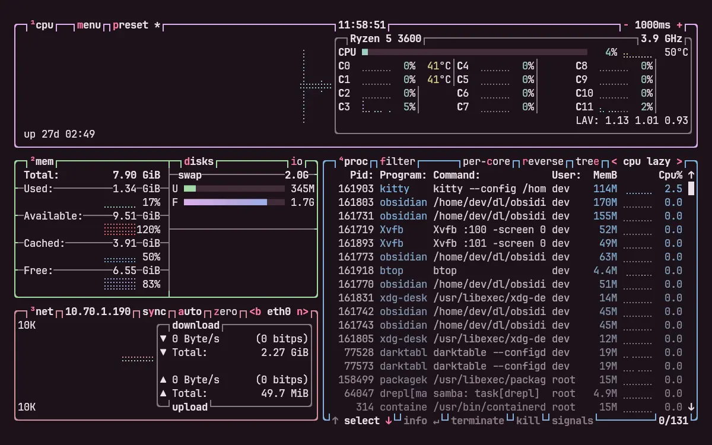

<h3 align="center">
	 
	
	Darkberry for <a href="https://github.com/aristocratos/btop">btop++</a>
	
</h3>

	
	
	

	🫐 
	<a href="lingonberry/">🍒 </a>
	<a href="cloudberry/">🍊 </a>
	<a href="crowberry/">🍇 </a>
	<a href="blueberry/">💙 </a>

	

## Previews

🕯️ Wisp

🌾 Fen

🪦 Mire

🌑 Blackwater

## Usage

1. Copy a `.theme` file from this folder into `~/.config/btop/themes/`, keeping its name.
2. Pick it under Esc > Options > Color theme, or set `color_theme = "darkberry-mire"` in `btop.conf`.

btop lists themes by file name, so don't rename them. btop 1.3 or newer reads every key.
The process-list banner and followed-row keys arrived in 1.4.7, and older releases skip
them. If you run a transparent terminal, set `theme_background = False` in `btop.conf`
rather than editing the theme. If your terminal can't do truecolor, set `lowcolor = True`.

## 💝 Thanks to

- [shythulu](https://github.com/shythulu)

&nbsp;

	

	Copyright &copy; 2026-present <a href="https://github.com/shythulu/DarkBerry" target="_blank">shythulu</a>

	

