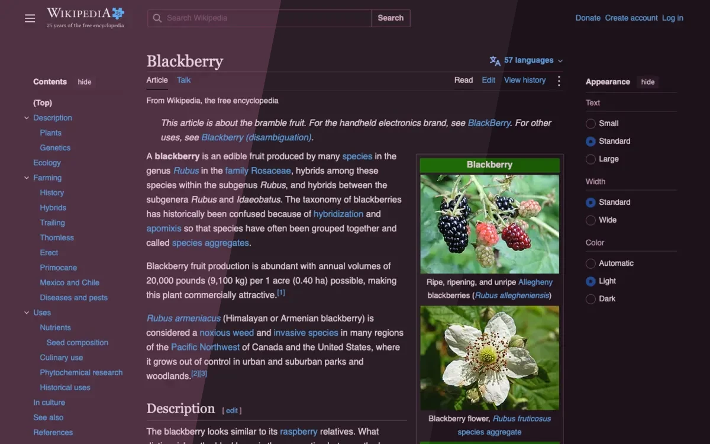
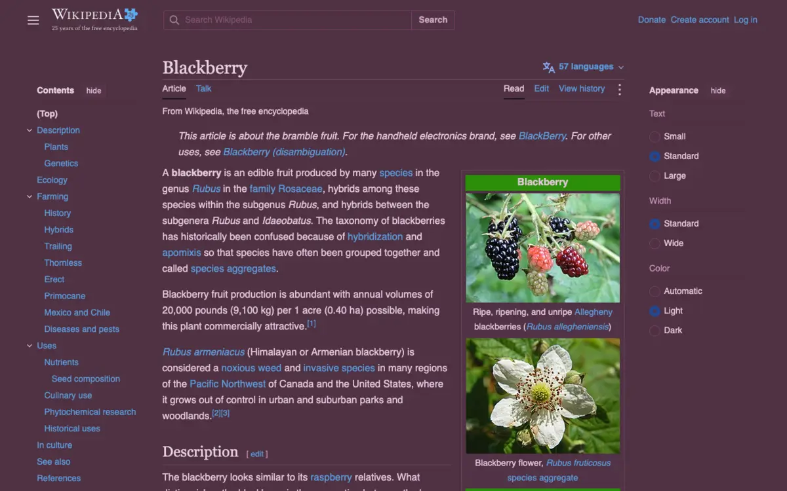
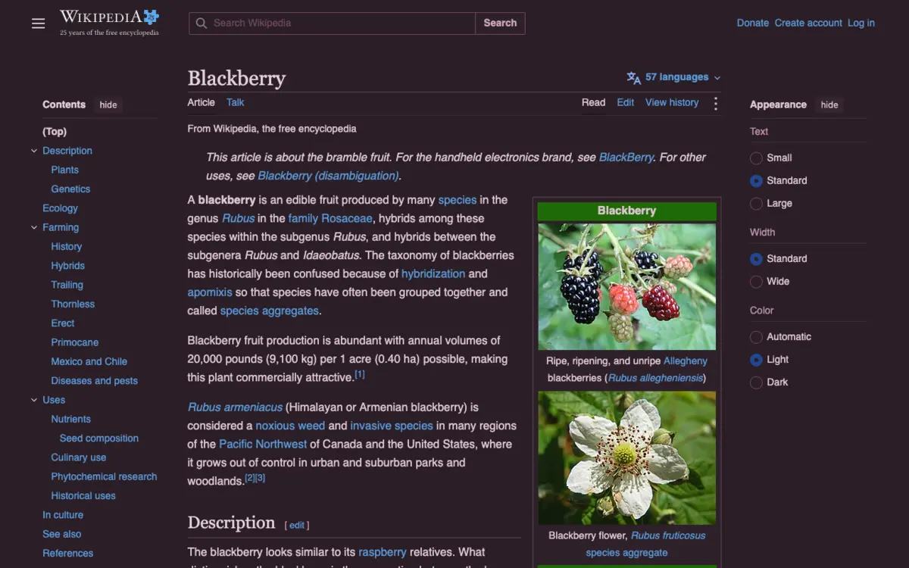
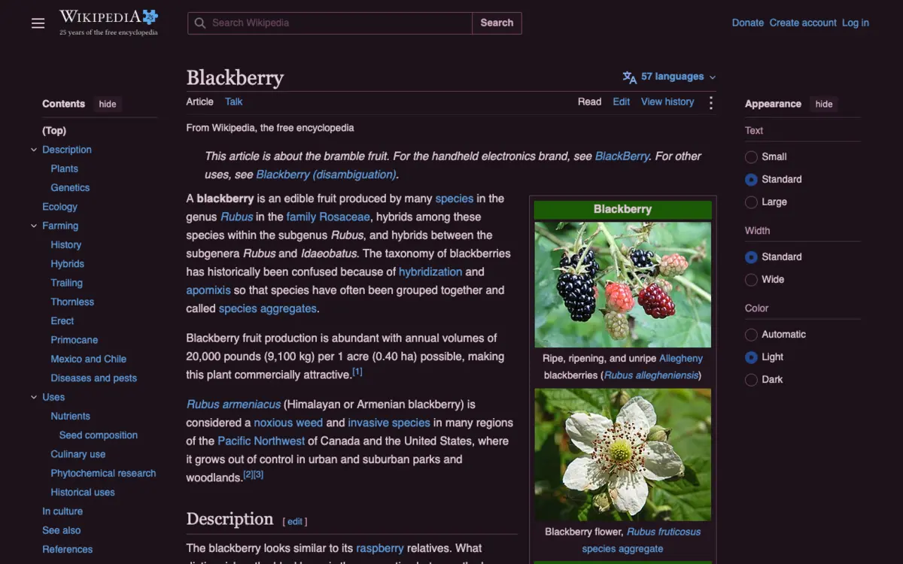

<h3 align="center">
	 
	
	Darkberry for <a href="https://darkreader.org">Dark Reader</a>
	
</h3>

	
	
	

	🫐 
	<a href="lingonberry/">🍒 </a>
	<a href="cloudberry/">🍊 </a>
	<a href="crowberry/">🍇 </a>
	<a href="blueberry/">💙 </a>

	

## Previews

🌾 Fen

🪦 Mire

🌑 Blackwater

## Usage

Dark Reader takes colours as settings, so there is no file to install. Each dark flavour's
`.txt` file in this folder holds the three values to type in.

1. Click the Dark Reader icon and make sure the theme is set to **Dark**. The Colors panel edits the
   colours of the current mode.
2. Open **See all options** > **Colors**. On desktop, Colors is part of Dark Reader's redesigned
   popup: if you don't see it, open **Dev Tools** from the popup and click **Enable design
   prototype** once.
3. Copy **Background** and **Text** from the flavour's file.
4. Change **Selection** from *Auto* to *Custom* and copy **Selection** from the file. Changes apply
   straight away; there is no save button.

Typing a Background or Text value resets Brightness, Contrast, Sepia and Grayscale to their
defaults, so adjust those afterwards if you use them. Leave **Scrollbar** on *Default*.

Needs Dark Reader 4.9.9 or newer. Only the Dynamic engine, Dark Reader's default, uses these
colours; Filter, Filter+ and Static ignore them.

There are three files: Fen, Mire and Blackwater. Wisp, the light flavour, is left out. In light
mode Dark Reader recolours pages toward the text colour, which doesn't look like Wisp.

## 🙋 FAQ

- Q: **Is there a quicker way than copying values?**\
  A: Once Dark Reader ships Darkberry in its own list, pick **Darkberry Fen**, **Darkberry Mire** or
  **Darkberry Blackwater** under **Color Scheme** in the same panel. That sets Background and Text;
  Selection is still copied by hand. The tints are only available by copying values.
- Q: **Why not import a settings file?**\
  A: Dark Reader's *Import Settings* replaces every setting the file names. A file carrying the
  colours would also reset your theme's other options.

## 💝 Thanks to

- [shythulu](https://github.com/shythulu)

&nbsp;

	

	Copyright &copy; 2026-present <a href="https://github.com/shythulu/DarkBerry" target="_blank">shythulu</a>

	

