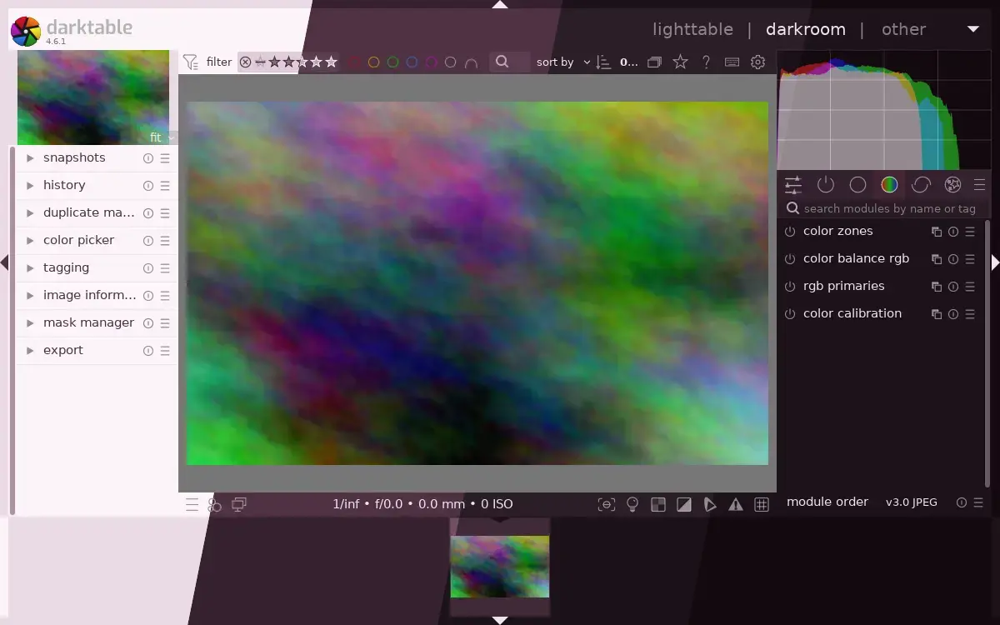
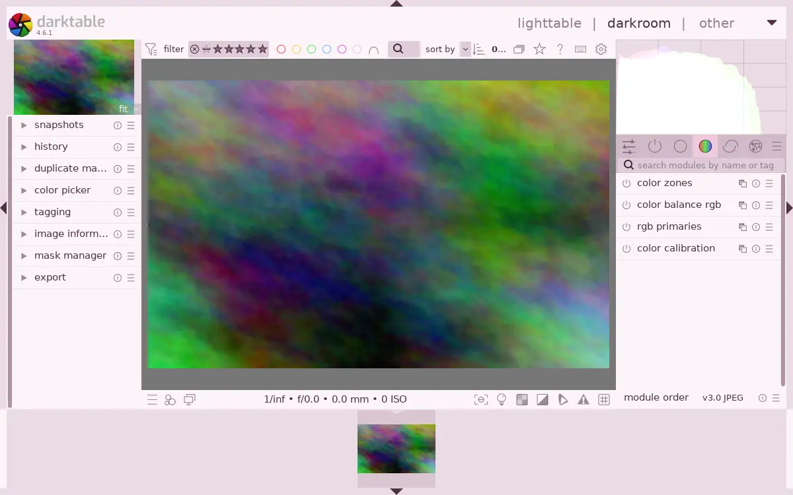
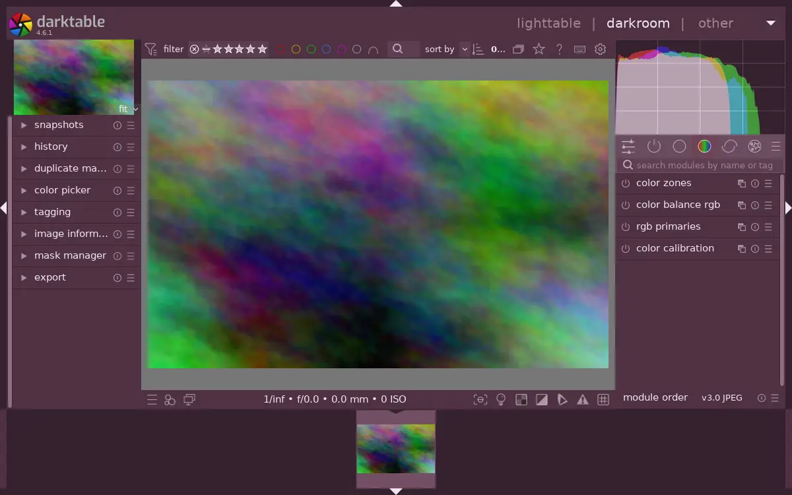
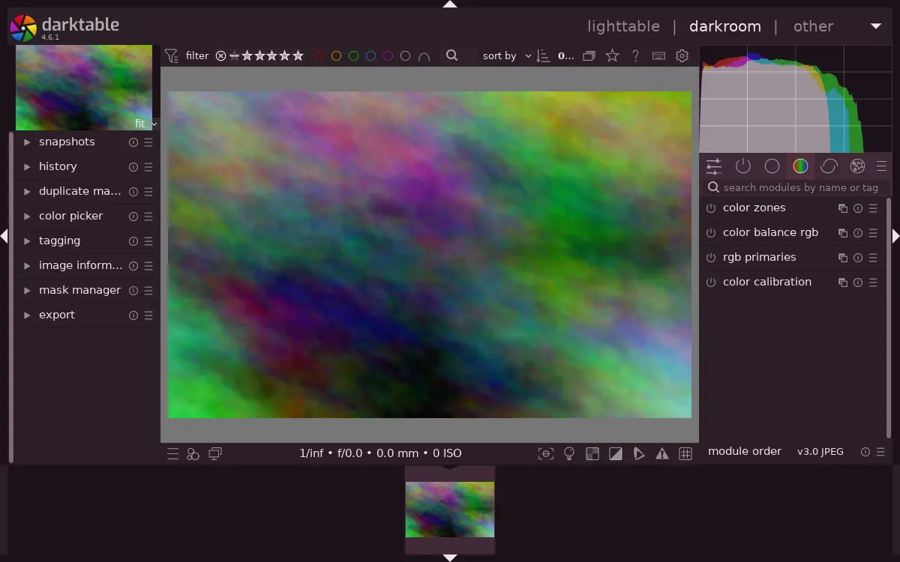
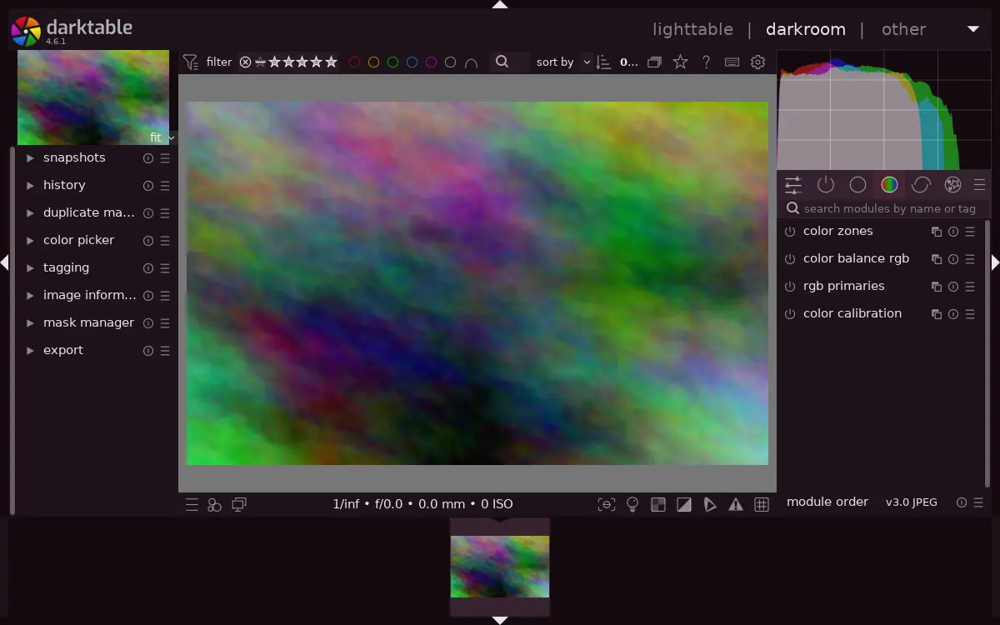

<h3 align="center">
	 
	
	Darkberry for <a href="https://www.darktable.org">darktable</a>
	
</h3>

	
	
	

	🫐 
	<a href="lingonberry/">🍒 </a>
	<a href="cloudberry/">🍊 </a>
	<a href="crowberry/">🍇 </a>
	<a href="blueberry/">💙 </a>

	

## Previews

🕯️ Wisp

🌾 Fen

🪦 Mire

🌑 Blackwater

## Usage

darktable ignores the system GTK theme and uses its own CSS, so the [GTK 3](../gtk) port
doesn't reach it. This one does.

1. Copy a flavour from this folder beside darktable's own CSS, so its `@import` resolves. The header of each file gives the path.
2. Pick it in darktable's preferences under General > Theme.

One honest warning. A coloured frame around a photo changes how you judge the colours
inside it, which is why darktable ships grey themes. Darkberry uses its least saturated
colours around the image, but for serious grading, switch back to a grey theme and come
back to me when you're done.

## 💝 Thanks to

- [shythulu](https://github.com/shythulu)

&nbsp;

	

	Copyright &copy; 2026-present <a href="https://github.com/shythulu/DarkBerry" target="_blank">shythulu</a>

	

