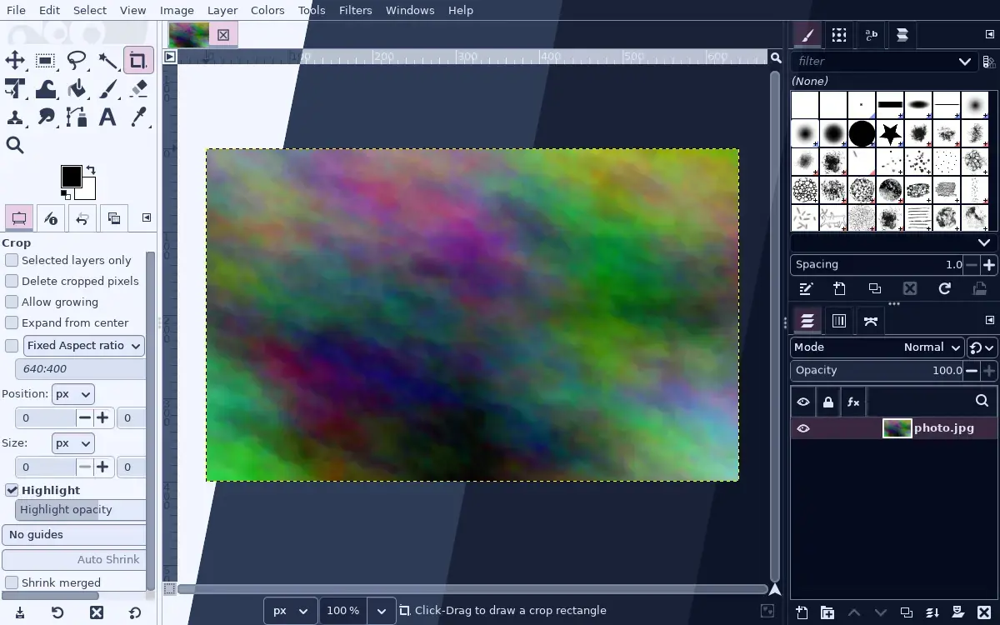
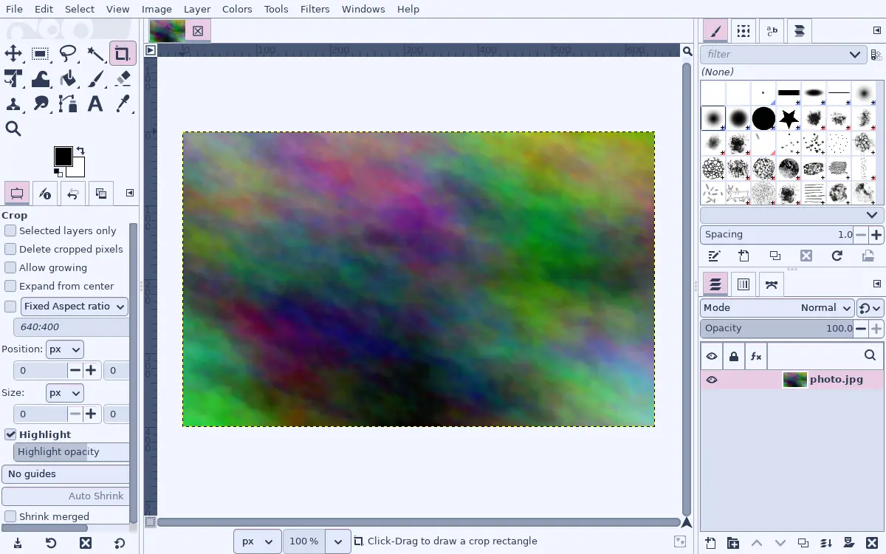
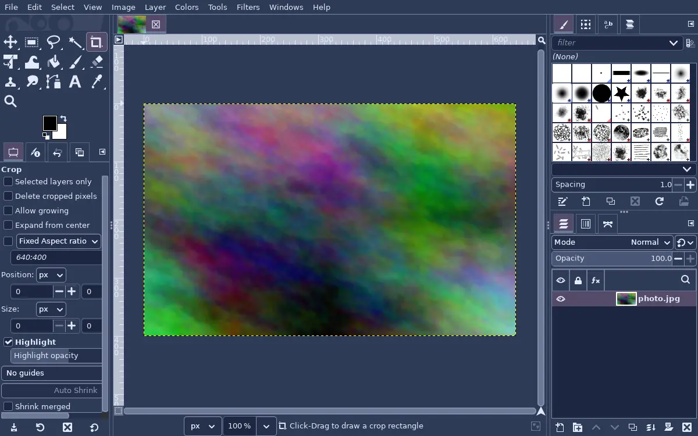
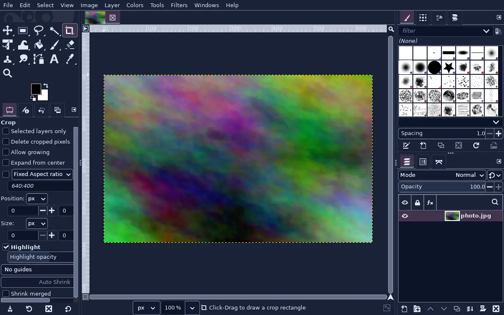
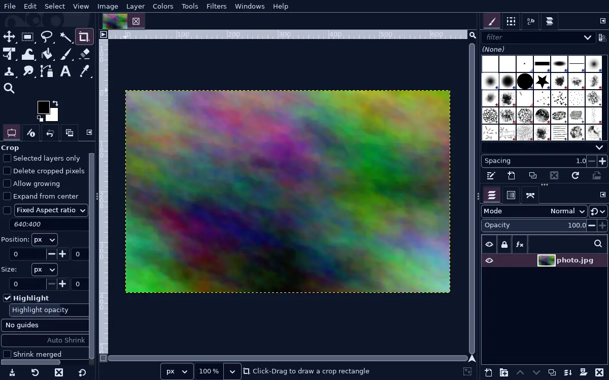

<h3 align="center">
	 
	
	Blueberry for <a href="https://www.gimp.org">GIMP</a>
	
</h3>

	
	
	

	<a href="../">🫐 </a>
	<a href="../lingonberry/">🍒 </a>
	<a href="../cloudberry/">🍊 </a>
	<a href="../crowberry/">🍇 </a>
	💙 

	

## Previews

🕯️ Wisp

🌾 Fen

🪦 Mire

🌑 Blackwater

## Usage

GIMP ignores the system GTK theme and uses its own, so the [GTK 3](../gtk) port doesn't
reach it. This one does.

1. Copy GIMP's `Default` theme folder (usually `/usr/share/gimp/3.0/themes/Default`) to `~/.config/GIMP/<version>/themes/Darkberry Mire/`. Copy its `System` folder to the same place too, because `Default`'s `common.css` imports `../System/gimp.css`. `<version>` is GIMP's own folder name (`3.0`, `3.2` and so on).
2. Copy a flavour from this folder into that new theme folder as `gimp-dark.css` (`gimp-light.css` for Wisp). It imports `common-dark.css` from beside it, which is why step 1 has to come first.
3. Pick it under Edit > Preferences > Interface > Theme.

One honest warning. A coloured frame around a photo changes how you judge the colours
inside it, which is why GIMP ships grey themes. Darkberry uses its least saturated colours
around the image, but for serious grading, switch back to a grey theme and come back to me
when you're done. The palette itself, for the colour picker, is the
[GIMP Palette](../gpl) port.

## 💝 Thanks to

- [shythulu](https://github.com/shythulu)

&nbsp;

	

	Copyright &copy; 2026-present <a href="https://github.com/shythulu/DarkBerry" target="_blank">shythulu</a>

	

