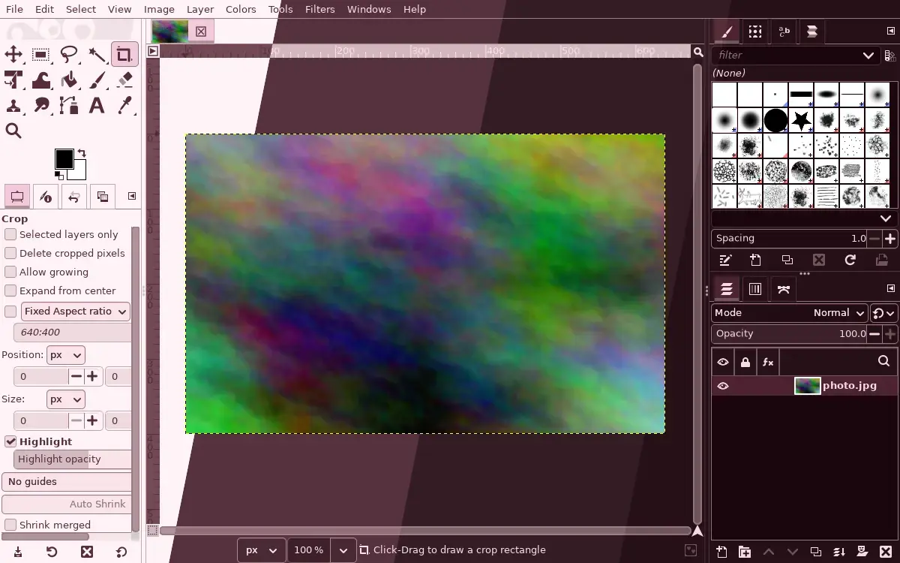
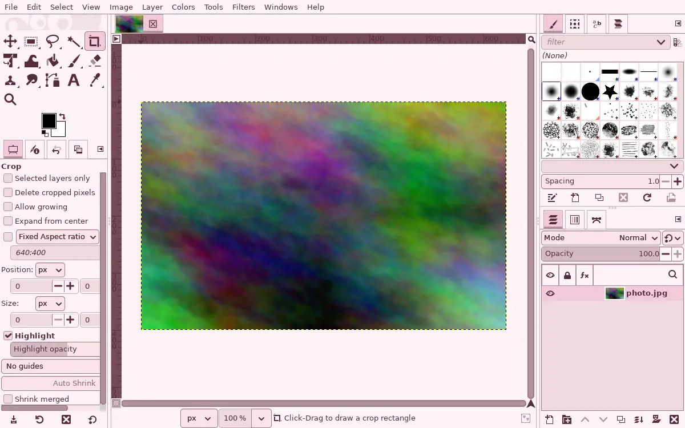
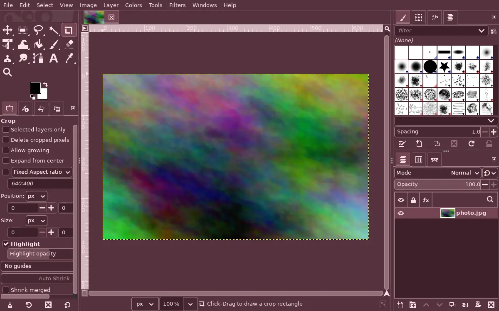
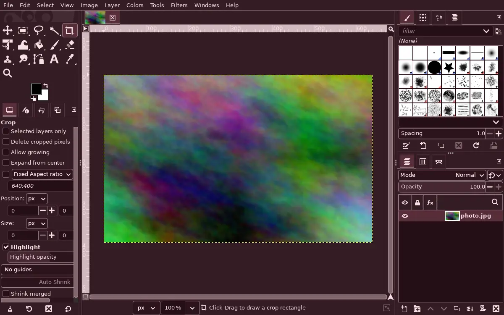
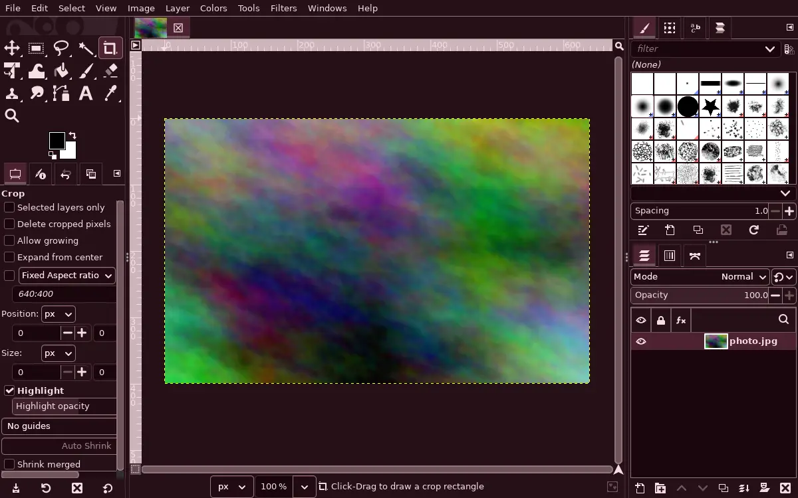

<h3 align="center">
	 
	
	Lingonberry for <a href="https://www.gimp.org">GIMP</a>
	
</h3>

	
	
	

	<a href="../">🫐 </a>
	🍒 
	<a href="../cloudberry/">🍊 </a>
	<a href="../crowberry/">🍇 </a>
	<a href="../blueberry/">💙 </a>

	

## Previews

🕯️ Wisp

🌾 Fen

🪦 Mire

🌑 Blackwater

## Usage

GIMP ignores the system GTK theme and uses its own, which is why this port exists beside
the [GTK 3](../gtk) one.

1. Copy GIMP's `Default` theme folder (usually `/usr/share/gimp/3.0/themes/Default`) to `~/.config/GIMP/<version>/themes/Darkberry Mire/`, and its `System` folder beside it: `Default`'s `common.css` imports `../System/gimp.css`. The version folder is GIMP's own (`3.0`, `3.2`, ...).
2. Copy a flavour from this folder into that theme folder as `gimp-dark.css` (`gimp-light.css` for Wisp), so its `@import` of `common-dark.css` resolves.
3. Pick it under Edit > Preferences > Interface > Theme.

For colour work, keep the image surround neutral. A saturated frame shifts how you judge
colour in the picture, which is why GIMP ships greys. Darkberry uses its least saturated
colours there, but a grey theme is still the right tool for grading. The palette itself, for
the colour picker, is the [GIMP Palette](../gpl) port.

## 💝 Thanks to

- [shythulu](https://github.com/shythulu)

&nbsp;

	

	Copyright &copy; 2026-present <a href="https://github.com/shythulu/DarkBerry" target="_blank">shythulu</a>

	

