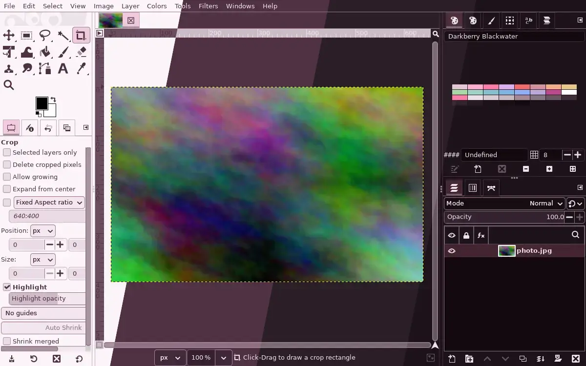
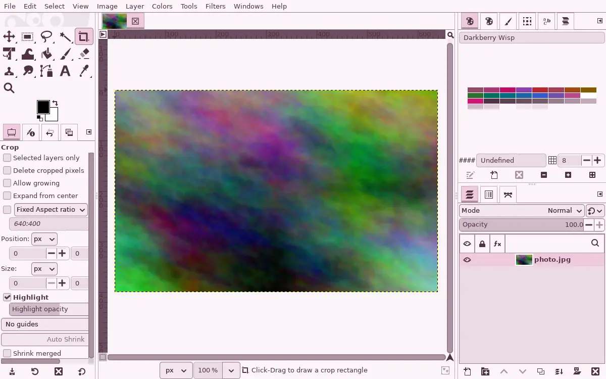
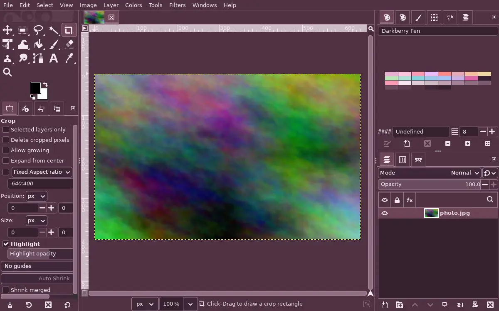
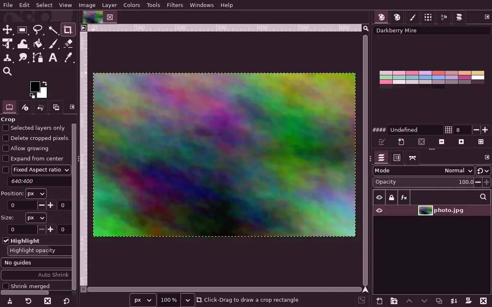
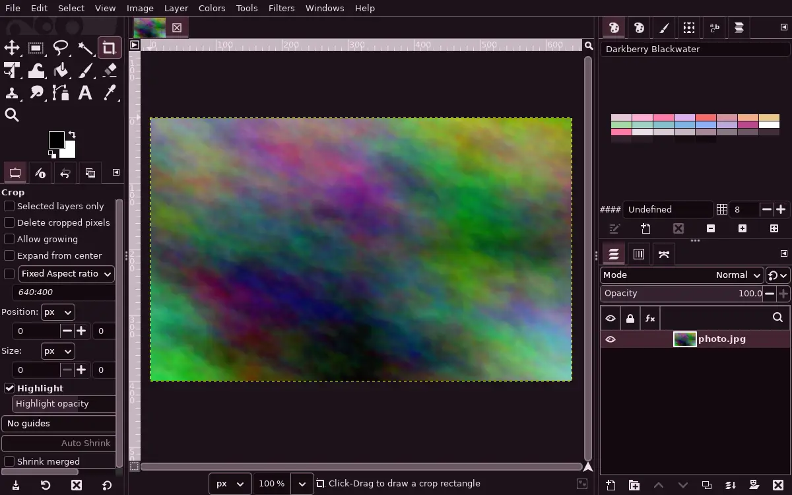

<h3 align="center">
	 
	
	Darkberry for <a href="https://docs.gimp.org/en/gimp-concepts-palettes.html">GIMP Palette</a>
	
</h3>

	
	
	

	

## Previews

🕯️ Wisp

🌾 Fen

🪦 Mire

🌑 Blackwater

## Usage

The palette itself, not a theme, in the GIMP palette format that GIMP, Inkscape, Krita,
MyPaint and Aseprite all import. There is one file per flavour and `darkberry.gpl` with
every flavour's colours, each labelled with its flavour and name.

- GIMP: Edit > Preferences > Folders > Palettes shows the folder; copy the files in, or
  Windows > Dockable Dialogs > Palettes, then Import Palette from a file.
- Inkscape: copy the files into `~/.config/inkscape/palettes/` and pick them from the
  menu at the left end of the palette bar.
- Krita: Settings > Manage Resources > Import Resources.

## 💝 Thanks to

- [shythulu](https://github.com/shythulu)

&nbsp;

	

	Copyright &copy; 2026-present <a href="https://github.com/shythulu/DarkBerry" target="_blank">shythulu</a>

	

