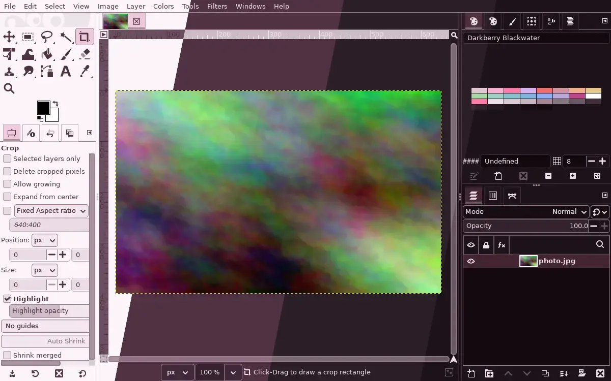
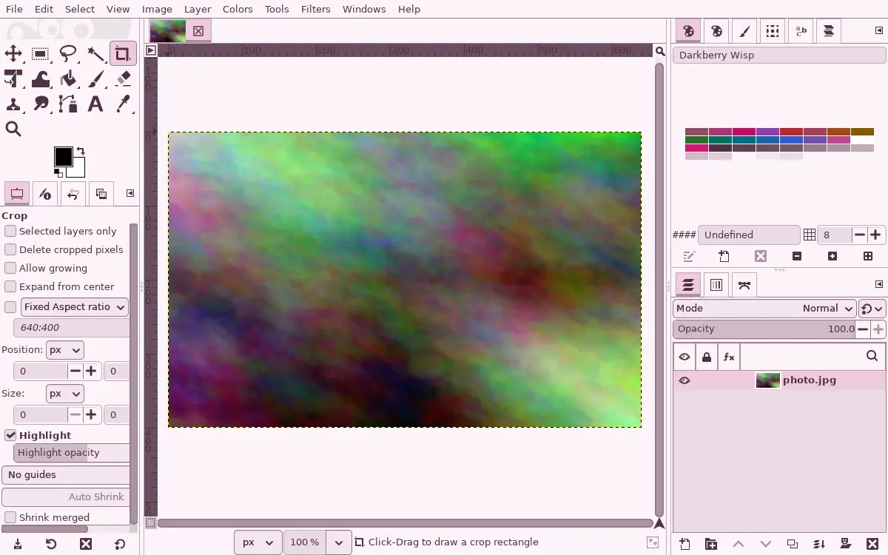
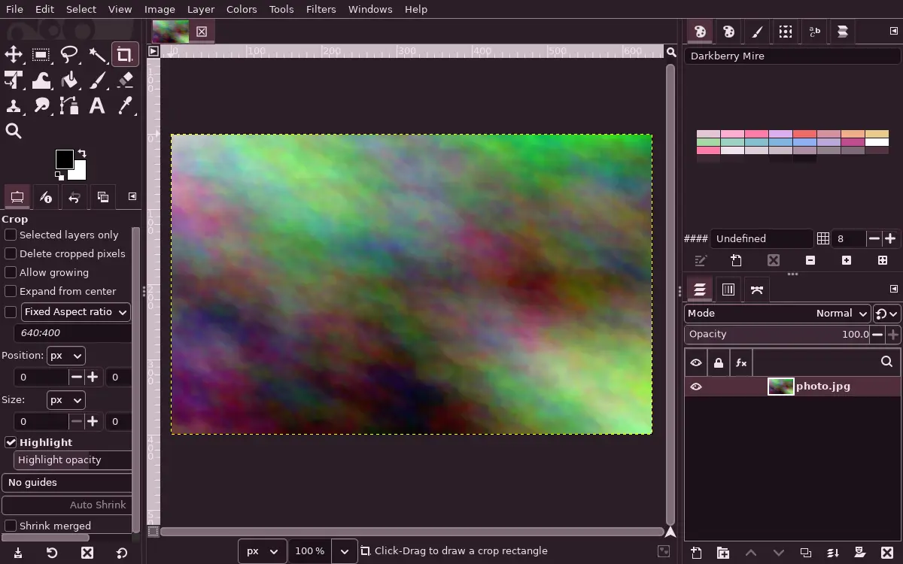
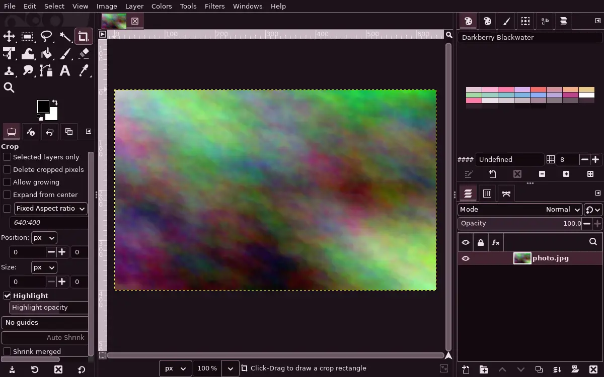

<h3 align="center">
	 
	
	Darkberry for <a href="https://docs.gimp.org/en/gimp-concepts-palettes.html">GIMP Palette</a>
	
</h3>

	
	
	

	
	
	
	
	

	

## Previews

🕯️ Wisp

🌾 Fen

🪦 Mire

🌑 Blackwater

## Usage

The palette itself, not a theme, in the GIMP palette format that GIMP, Inkscape, Krita,
MyPaint and Aseprite all import.

1. Pick a file from this folder: one per flavour (`darkberry-mire.gpl` and so on), or
   `darkberry.gpl` with every flavour's colours, each labelled with its flavour and name.
2. Import it:
   - GIMP: Edit > Preferences > Folders > Palettes shows the folder; copy the file in, or
     open Windows > Dockable Dialogs > Palettes and choose Import Palette.
   - Inkscape: copy the file into `~/.config/inkscape/palettes/` and pick it from the
     menu at the left end of the palette bar.
   - Krita: Settings > Manage Resources > Import Resources.

Each tint is one file with its four flavours (`lingonberry.gpl` and so on), and
`darkberry-with-tints.gpl` holds all twenty.

## Created by

- [shythulu](https://github.com/shythulu)

&nbsp;

	

	Copyright &copy; 2026-present <a href="https://github.com/shythulu/DarkBerry" target="_blank">shythulu</a>

	

