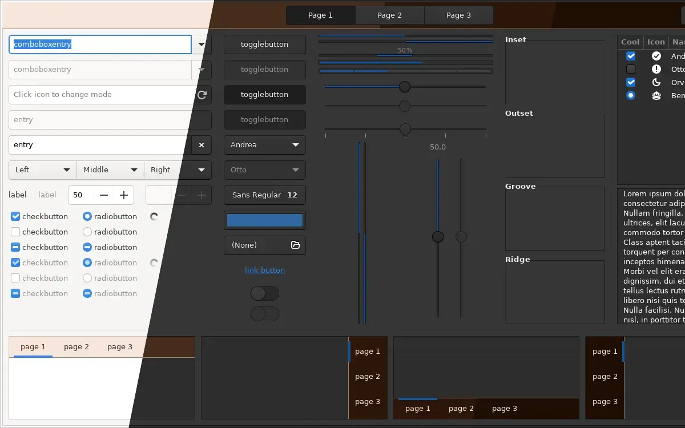
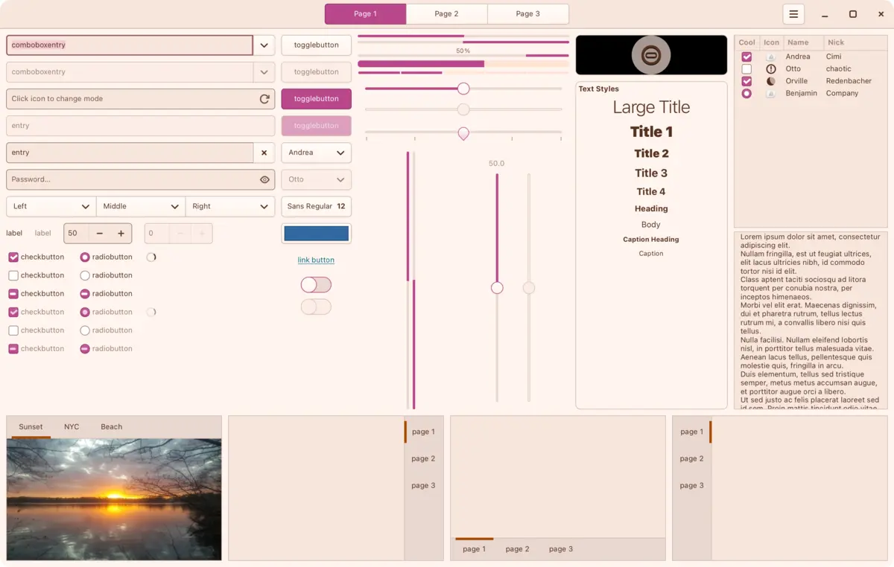
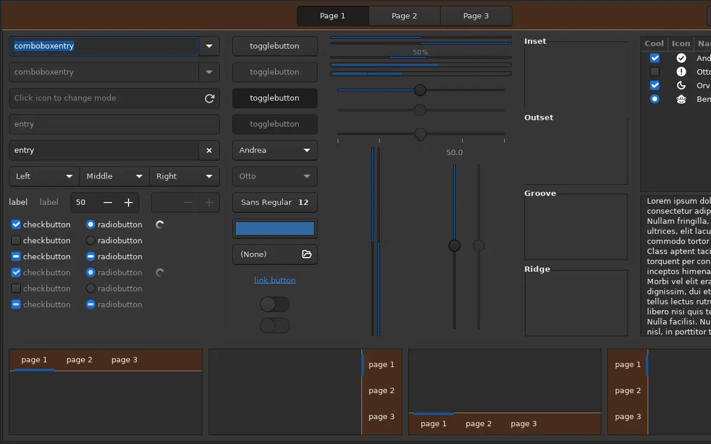
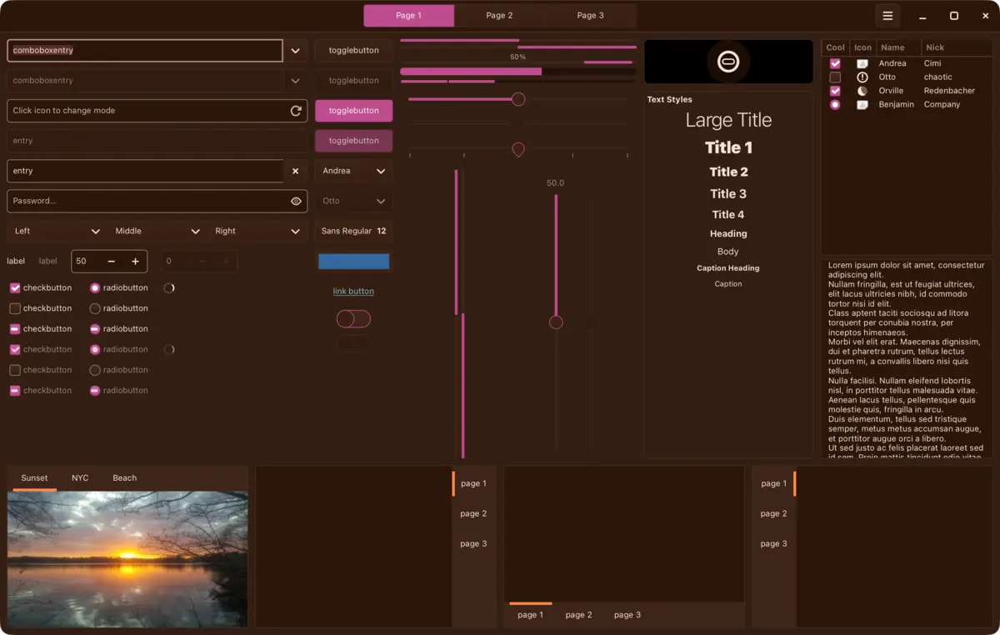
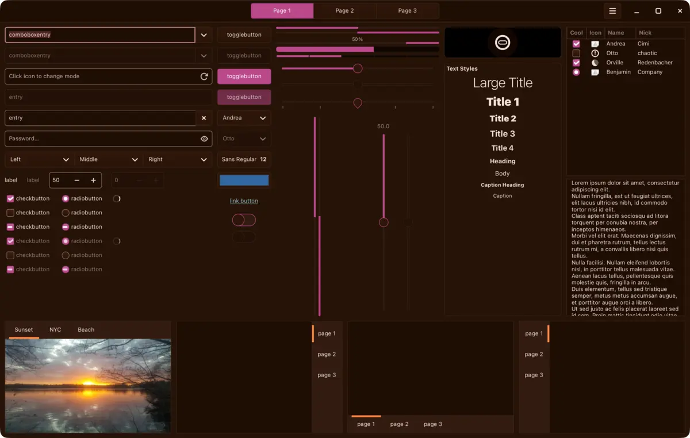

<h3 align="center">
	 
	
	Cloudberry for <a href="https://www.gtk.org">GTK</a>
	
</h3>

	
	
	

	
	
	
	
	

	

## Previews

🕯️ Wisp

🌾 Fen

🪦 Mire

🌑 Blackwater

## Usage

Not on a theme store yet. The files are in [ports/gtk/cloudberry](https://github.com/shythulu/DarkBerry/tree/main/ports/gtk/cloudberry); install them by hand:

1. Copy a flavour folder from this folder into `~/.themes/` (or `~/.local/share/themes/`).
2. Select it as your GTK theme: `gsettings set org.gnome.desktop.interface gtk-theme "Darkberry Mire"`, or your desktop's appearance settings.
3. For Flatpak apps, let them read the folder: `flatpak override --user --filesystem=~/.themes`.

Needs GTK 3.24 for `gtk-3.0`; `gtk-4.0` is checked on GTK 4.24.

The theme reaches Inkscape and any other GTK 3 or GTK 4 app that follows the system theme.
Each flavour is GTK's own Adwaita stylesheet compiled with Darkberry's colours, the way
Catppuccin's GTK port compiled Colloid with its own, so every widget takes the palette.
Apps built on libadwaita (most of GNOME's own) ignore the GTK theme and are not reached.
GIMP and darktable use their own themes; see the [GIMP](../gimp) and
[darktable](../darktable) ports.

## Created by

- [shythulu](https://github.com/shythulu)

&nbsp;

	

	Copyright &copy; 2026-present <a href="https://github.com/shythulu/DarkBerry" target="_blank">shythulu</a>

	

