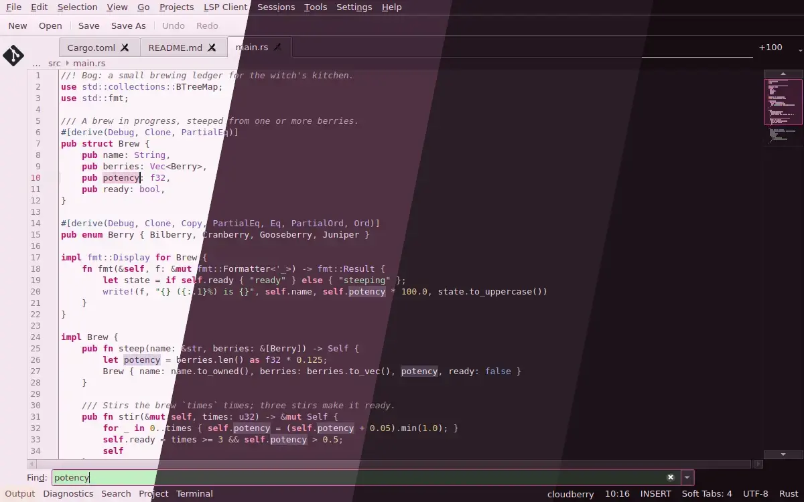
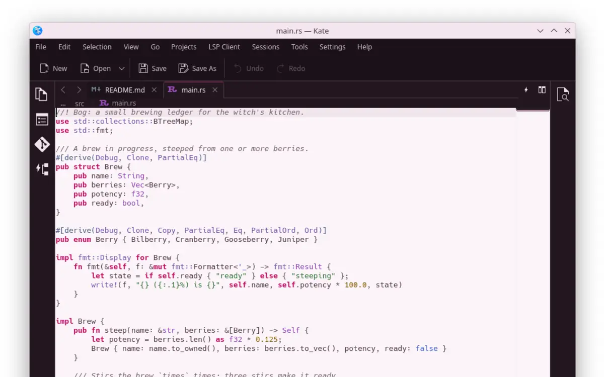
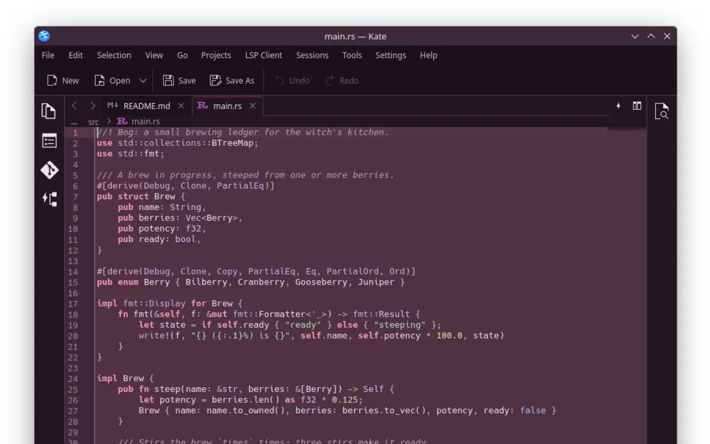
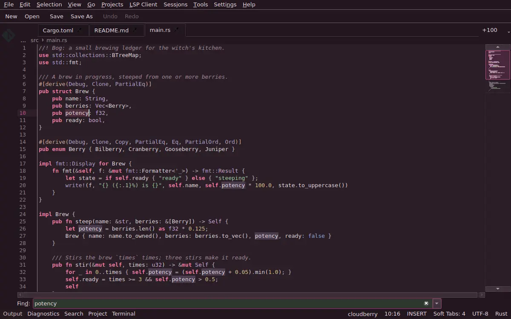
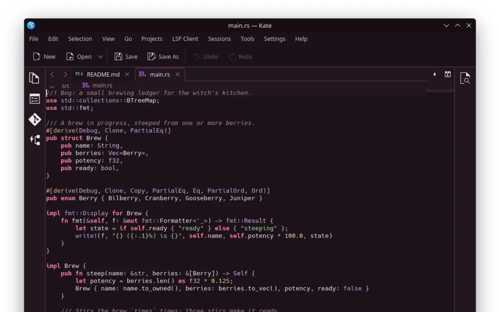

<h3 align="center">
	 
	
	Darkberry for <a href="https://kate-editor.org">Kate</a>
	
</h3>

	
	
	

	

## Previews

🕯️ Wisp

🌾 Fen

🪦 Mire

🌑 Blackwater

## Usage

1. Copy a `.theme` file from this folder into `~/.local/share/org.kde.syntax-highlighting/themes/`.
2. Settings > Configure Kate > Fonts & Colors, then pick a flavour.

The surrounding window chrome comes from the [KDE Plasma](../kde) colour scheme.

## 💝 Thanks to

- [shythulu](https://github.com/shythulu)

&nbsp;

	

	Copyright &copy; 2026-present <a href="https://github.com/shythulu/DarkBerry" target="_blank">shythulu</a>

	

