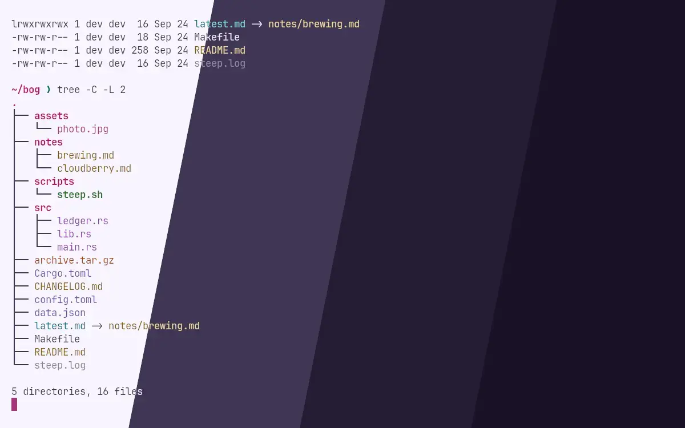
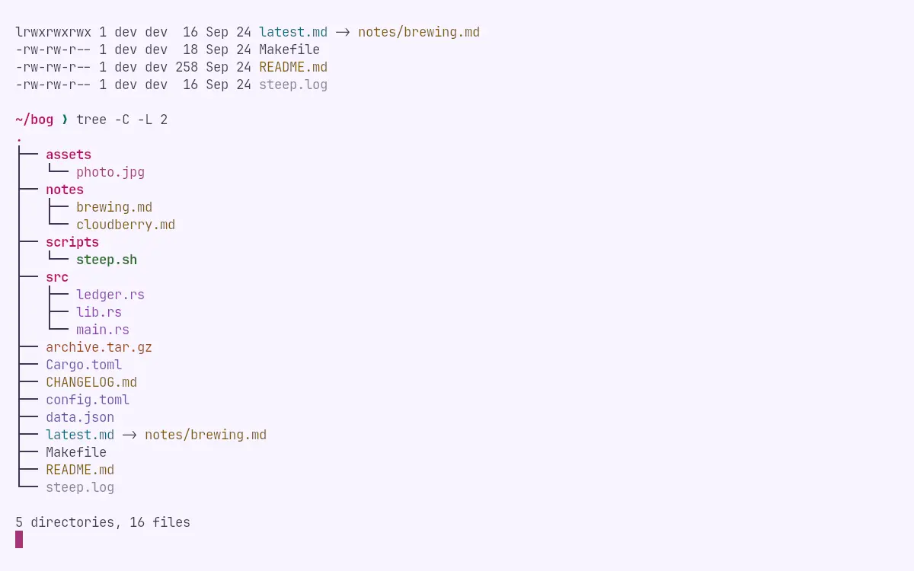
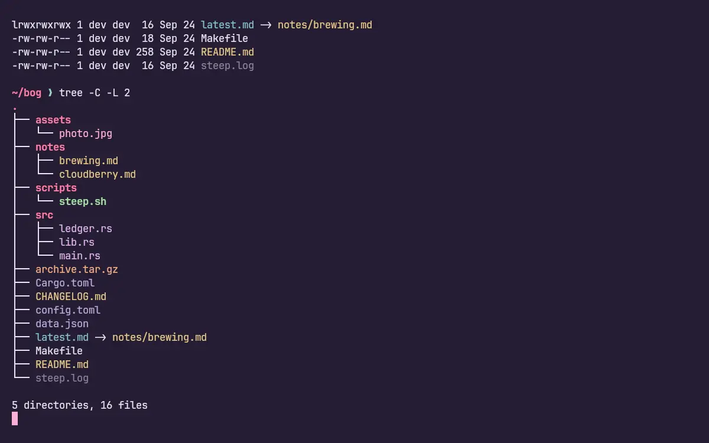
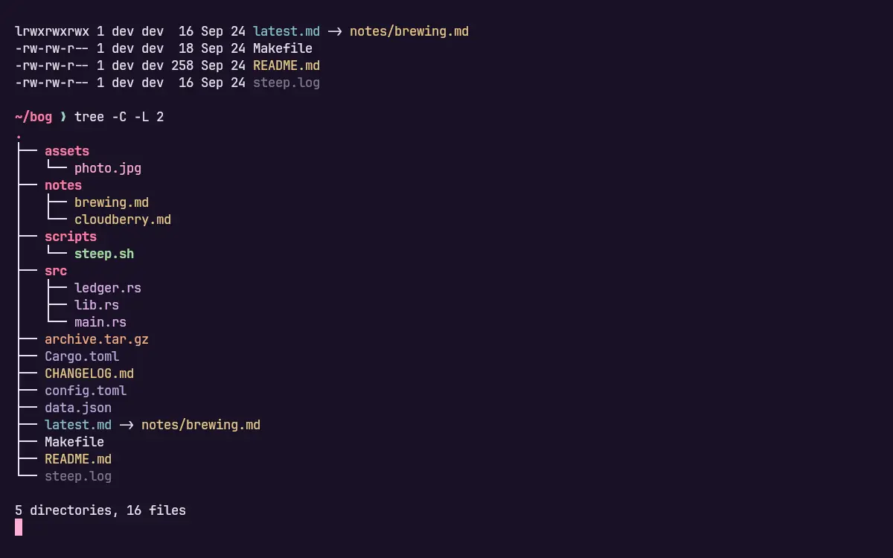

<h3 align="center">
	<br/>
	
	Crowberry for <a href="https://www.gnu.org/software/coreutils/manual/html_node/dircolors-invocation.html">LS_COLORS</a>
	
</h3>

<p align="center">
	<a href="https://github.com/shythulu/DarkBerry/stargazers"></a>
	<a href="https://github.com/shythulu/DarkBerry/issues"></a>
	<a href="https://github.com/shythulu/DarkBerry/contributors"></a>
</p>

<p align="center">
	<a href="../">🫐 </a>
	<a href="../lingonberry/">🍒 </a>
	<a href="../cloudberry/">🍊 </a>
	🍇 
	<a href="../blueberry/">💙 </a>
</p>

<p align="center">
	
</p>

## Previews

<details>
<summary>🕯️ Wisp</summary>

</details>
<details>
<summary>🌾 Fen</summary>

</details>
<details>
<summary>🪦 Mire</summary>

</details>
<details>
<summary>🌑 Blackwater</summary>

</details>

## Usage

1. Copy a flavour from this folder to `~/.config/darkberry/`.
2. Source it in your shell rc:

   ```sh
   . ~/.config/darkberry/darkberry-mire.sh
   ```

It exports `LS_COLORS`, which lsd, GNU `ls`, eza, fd, dust, delta and zsh's completion menu
all read, so the one file themes every listing on the machine. Directories take the accent;
source, configuration, prose, media and archives each take a hue; build leavings and backups
sit under the reading colour. Executables stay green and symlinks stay cool, because those
two meanings are older than any theme.

BSD `ls`, which is what macOS ships without coreutils, reads `LSCOLORS` instead, a different
format limited to the eight ANSI colours, which cannot carry these. Use lsd or GNU `ls` there.

## 💝 Thanks to

- [shythulu](https://github.com/shythulu)

&nbsp;

<p align="center">
	
</p>

<p align="center">
	Copyright &copy; 2026-present <a href="https://github.com/shythulu/DarkBerry" target="_blank">shythulu</a>
</p>

<p align="center">
	<a href="https://github.com/shythulu/DarkBerry/blob/main/LICENSE"></a>
</p>
