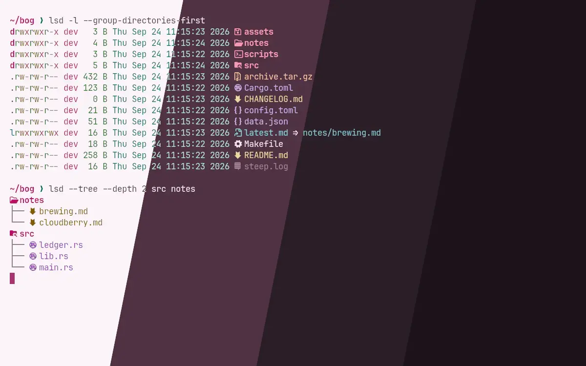
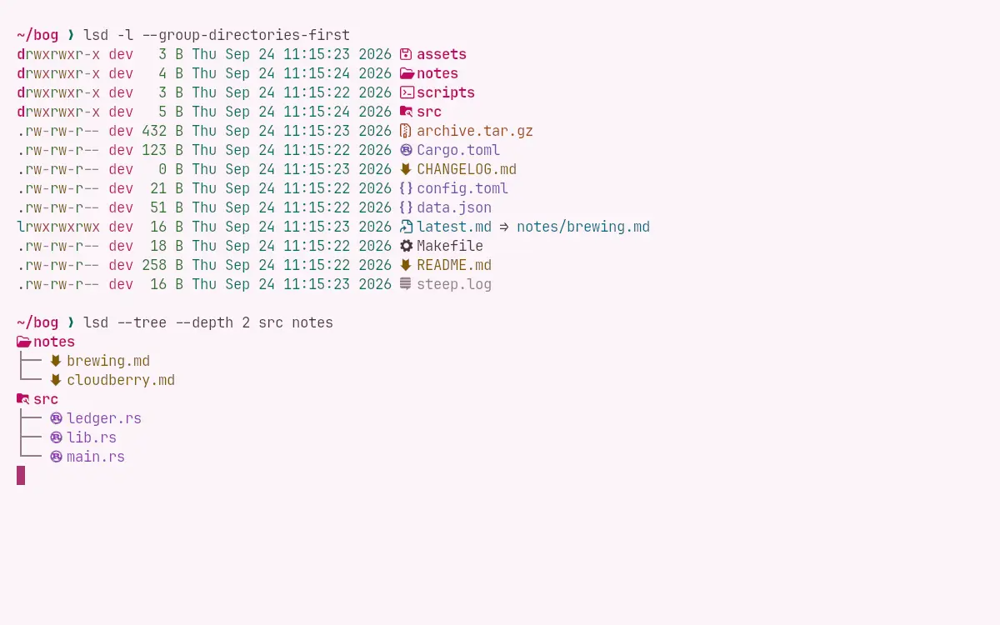
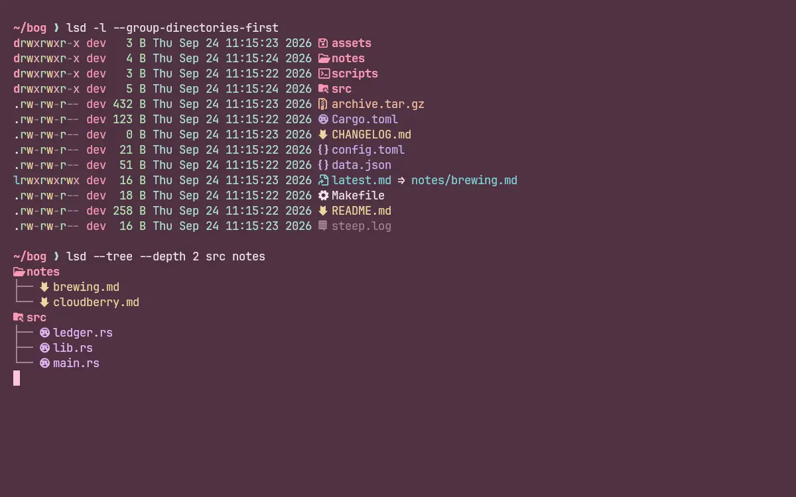
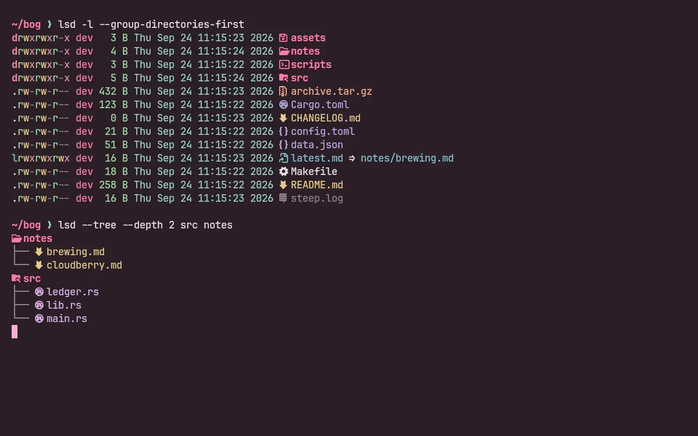
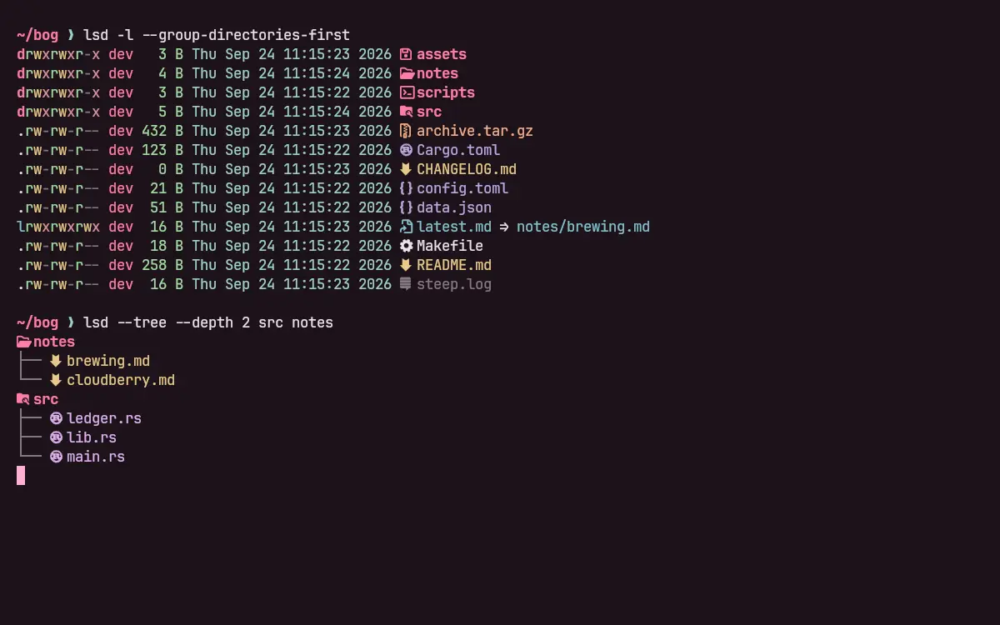

<h3 align="center">
	 
	
	Darkberry for <a href="https://github.com/lsd-rs/lsd">lsd</a>
	
</h3>

	
	
	

	🫐 
	<a href="lingonberry/">🍒 </a>
	<a href="cloudberry/">🍊 </a>
	<a href="crowberry/">🍇 </a>
	<a href="blueberry/">💙 </a>

	

## Previews

🕯️ Wisp

🌾 Fen

🪦 Mire

🌑 Blackwater

## Usage

1. Copy a flavour from this folder to `~/.config/lsd/colors.yaml`.
2. Set `color: {theme: custom}` in `~/.config/lsd/config.yaml`.

You need lsd 1.1 or newer. Older versions reject hex colours and drop the whole theme
without a word, so on lsd 1.0 (what Ubuntu 24.04 ships) use the `.256.yaml` file beside
each flavour. It's the same theme in xterm-256 indices.

lsd 1.2.0 rejects any key it doesn't know, and when it finds one it throws the whole file
away and falls back to its defaults, again without saying so. `file-type` is one of those
keys in 1.2.0, so it isn't in these files. Every key here is one that 1.2.0 accepts.

That missing key is also why the [LS_COLORS](../ls-colors) port exists, and why you want
both. `colors.yaml` only reaches the metadata columns. File and folder names, which are
most of what a listing shows, stay on lsd's stock blue and green until `LS_COLORS` is set.

## 💝 Thanks to

- [shythulu](https://github.com/shythulu)

&nbsp;

	

	Copyright &copy; 2026-present <a href="https://github.com/shythulu/DarkBerry" target="_blank">shythulu</a>

	

