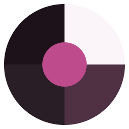
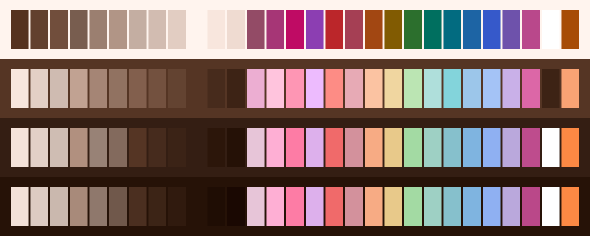
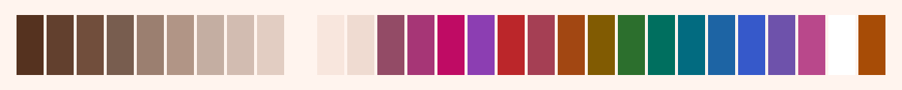
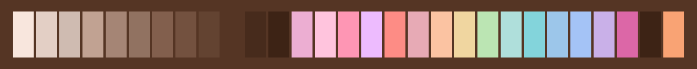
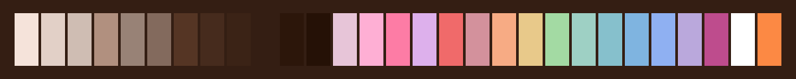
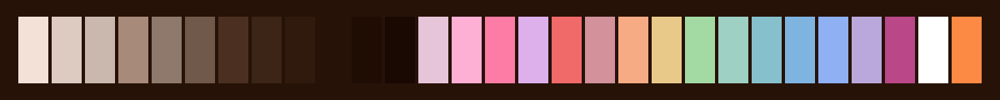

<h3 align="center">
	 
	
	Cloudberry for <a href="https://nimbalyst.com">Nimbalyst</a>
	
</h3>

	
	
	

	<a href="../">🫐 </a>
	<a href="../lingonberry/">🍒 </a>
	🍊 
	<a href="../crowberry/">🍇 </a>
	<a href="../blueberry/">💙 </a>

	

## Previews

🕯️ Wisp

🌾 Fen

🪦 Mire

🌑 Blackwater

## Usage

1. Copy a flavour's folder from this folder into Nimbalyst's themes directory.
2. Pick it under Settings > Themes.

Nimbalyst finds a theme by the `theme.json` inside its folder, so keep the folder intact.

## 💝 Thanks to

- [shythulu](https://github.com/shythulu)

&nbsp;

	

	Copyright &copy; 2026-present <a href="https://github.com/shythulu/DarkBerry" target="_blank">shythulu</a>

	

