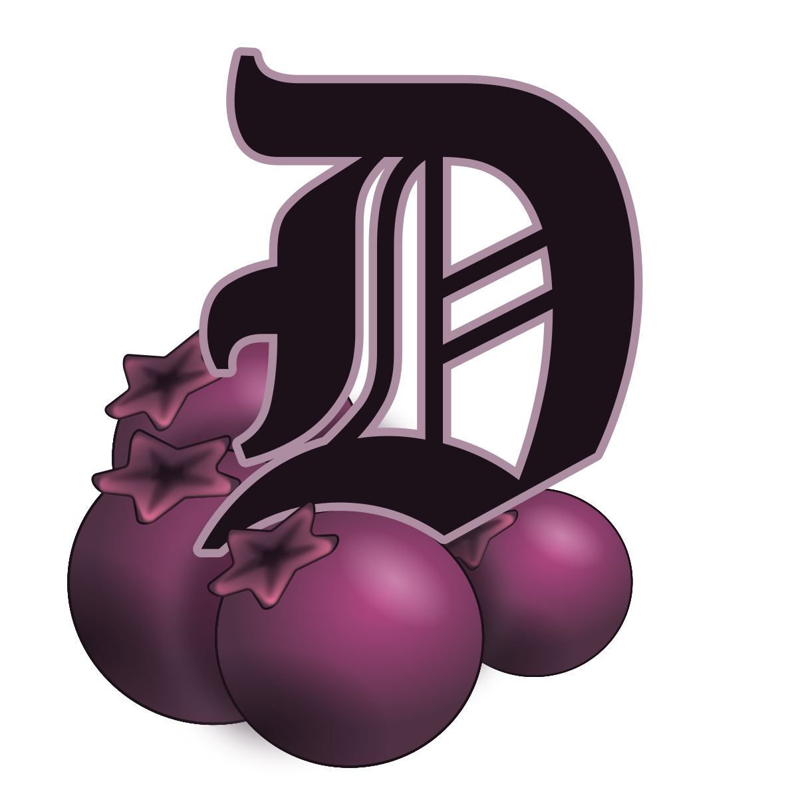
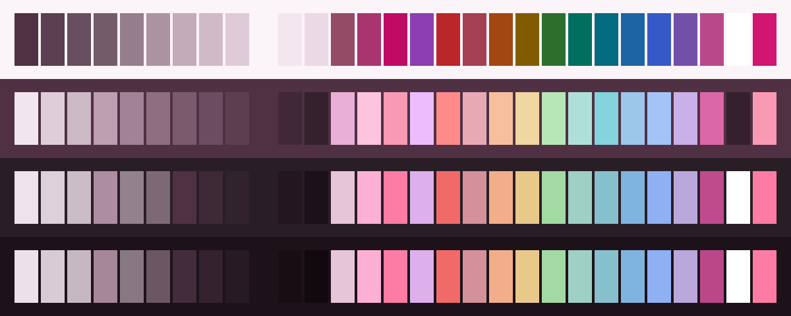
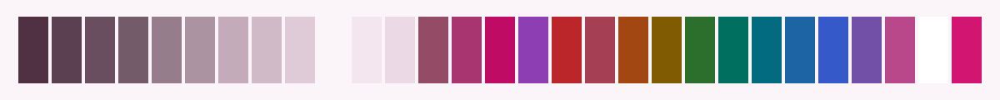
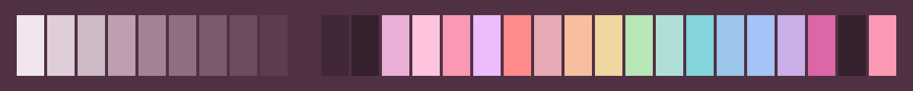
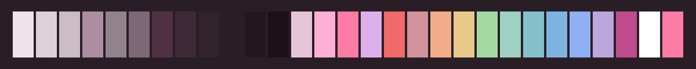
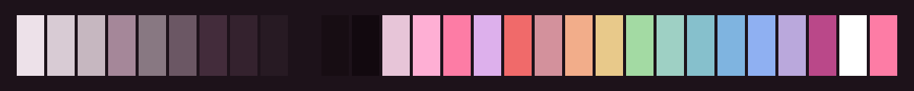

<h3 align="center">
	 
	
	Darkberry for <a href="https://t3.codes">T3 Code</a>
	
</h3>

	
	
	

	
	
	
	
	

	

## Previews

🕯️ Wisp

🌾 Fen

🪦 Mire

🌑 Blackwater

## Usage

1. Copy a flavour's `.json` file from this folder into `~/.t3/userdata/themes/` (the `themes`
   folder under your T3 Code state directory if you have moved it). The folder is watched, so
   the theme appears without a restart, and the file name is the theme's id.
2. Pick it under Settings > Appearance.

There are three files, Fen, Mire and Blackwater. Each carries Wisp, the light flavour, as its
light half, so whichever you pick, light mode shows Wisp and dark mode shows that flavour.

Or paste a file's contents into Settings > Appearance > Import theme, which keeps a copy inside
the app instead of following the file.

Needs T3 Code 0.0.40 or newer, which is where the key list was verified; the keys are unchanged
through 0.0.45. Syntax highlighting in code blocks and the terminal's sixteen ANSI colours are
not part of a T3 Code theme, so they stay the app's own.

## Created by

- [shythulu](https://github.com/shythulu)

&nbsp;

	

	Copyright &copy; 2026-present <a href="https://github.com/shythulu/DarkBerry" target="_blank">shythulu</a>

	

