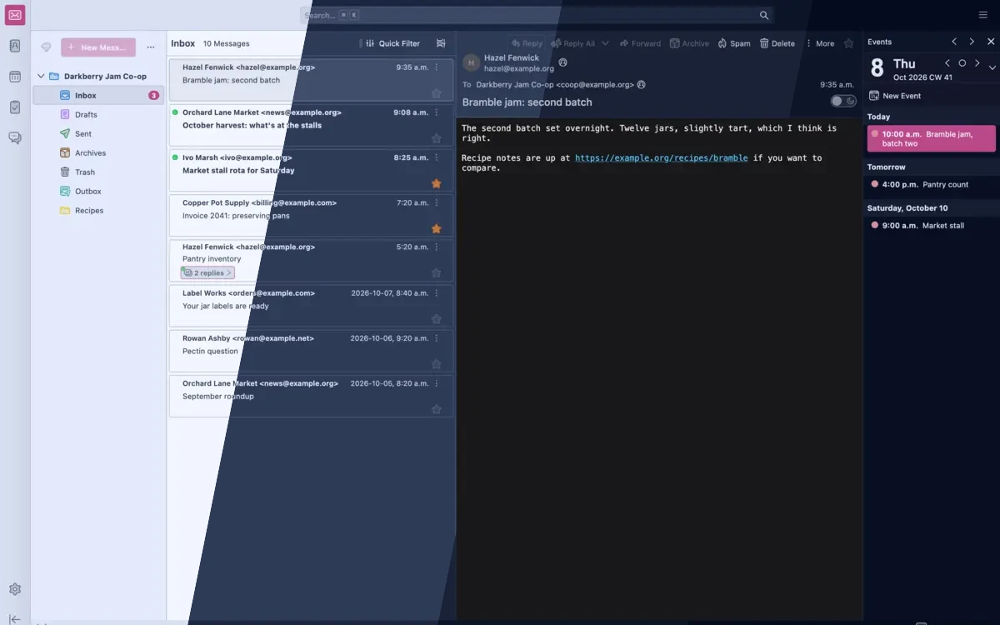
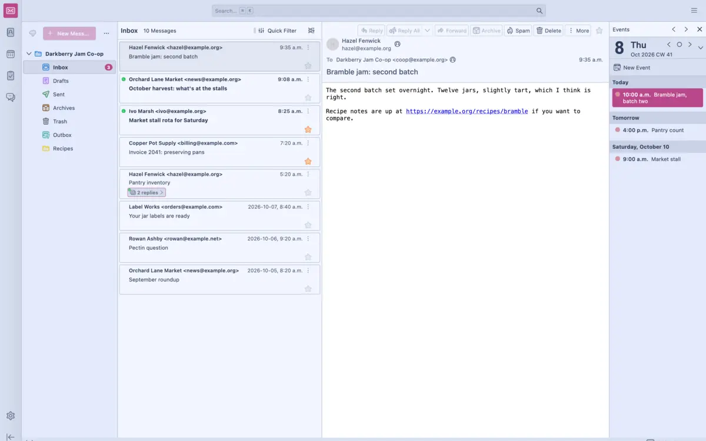
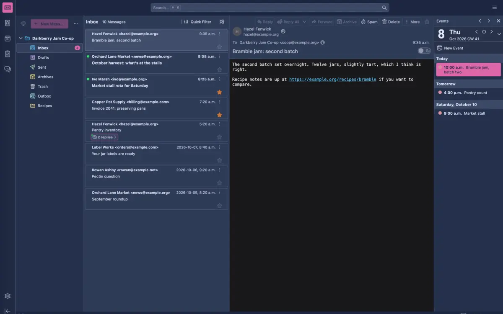
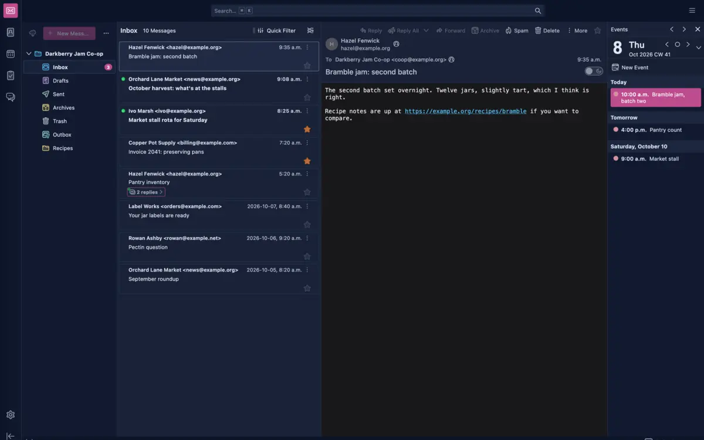
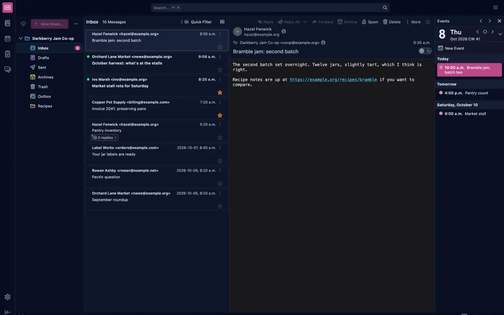

<h3 align="center">
	 
	
	Blueberry for <a href="https://www.thunderbird.net/">Thunderbird</a>
	
</h3>

	
	
	

	
	
	
	
	

	

## Previews

🕯️ Wisp

🌾 Fen

🪦 Mire

🌑 Blackwater

## Usage

Not on a theme store yet. The files are in [ports/thunderbird/blueberry](https://github.com/shythulu/DarkBerry/tree/main/ports/thunderbird/blueberry); install them by hand:

1. Download a flavour's `.xpi` from a [release](https://github.com/shythulu/DarkBerry/releases)
   (`darkberry-thunderbird-mire-<version>.xpi` and so on), or zip the two files in one of this
   folder's flavour folders (`manifest.json` and `theme.css`) into a file of your own.
2. In Thunderbird, open Tools > Add-ons and Themes, choose Install Add-on From File from the
   gear menu, and pick the file.
3. Enable the flavour under Themes.

Thunderbird does not require add-ons to be signed, so the unsigned file installs and stays
installed. To try a flavour without packaging it, open Tools > Developer Tools > Debug
Add-ons > Load Temporary Add-on and pick its `manifest.json`; it lasts until Thunderbird
restarts.

Checked on Thunderbird 157. A theme experiment carries the theme into the folder pane, the
message list and cards, the Spaces toolbar, the address book and the calendar.

Three things keep their own colours:

- The message body. It is web content, so it shows the sender's colours.
- The Settings tab. Thunderbird applies no theme there.
- Calendar events and categories. Each calendar's colour is set in its Properties, and each
  category's under Settings > Calendar > Categories.

## Created by

- [shythulu](https://github.com/shythulu)

&nbsp;

	

	Copyright &copy; 2026-present <a href="https://github.com/shythulu/DarkBerry" target="_blank">shythulu</a>

	

