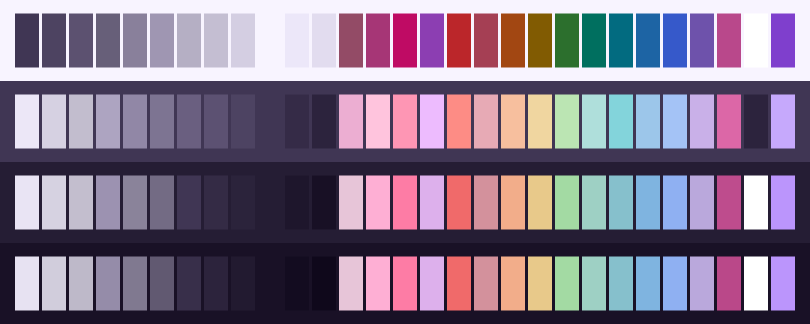
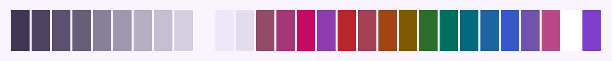
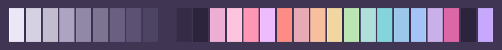
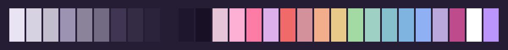
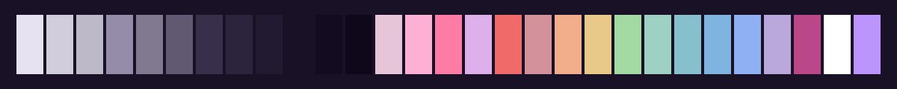

<h3 align="center">
	<br/>
	
	Crowberry for <a href="https://github.com/tinted-theming">Tinted8</a>
	
</h3>

<p align="center">
	<a href="https://github.com/shythulu/DarkBerry/stargazers"></a>
	<a href="https://github.com/shythulu/DarkBerry/issues"></a>
	<a href="https://github.com/shythulu/DarkBerry/contributors"></a>
</p>

<p align="center">
	<a href="../">🫐 </a>
	<a href="../lingonberry/">🍒 </a>
	<a href="../cloudberry/">🍊 </a>
	🍇 
	<a href="../blueberry/">💙 </a>
</p>

<p align="center">
	
</p>

## Previews

<details>
<summary>🕯️ Wisp</summary>

</details>
<details>
<summary>🌾 Fen</summary>

</details>
<details>
<summary>🪦 Mire</summary>

</details>
<details>
<summary>🌑 Blackwater</summary>

</details>

## Usage

Darkberry as a [Tinted Theming](https://github.com/tinted-theming) scheme. Tinted
Theming's builders turn one scheme file into config for seventy-odd applications.

1. Copy a flavour from this folder into a builder's schemes directory.
2. Build:

   ```sh
   tinty install                      # or: tinted-builder-rust build .
   ```

Tinted8 is the newer spec. A scheme gives eight anchor colours for the builder to expand,
and it can add optional `syntax` and `ui` blocks that say outright what each colour is for
instead of leaving the builder to guess. Darkberry fills both blocks. The syntax block
carries the same token assignments as the VS Code port, and the ui block names the cursor,
gutter, current line, selection and status colours. That makes this the more faithful of
the two Tinted Theming ports. If your template only knows Base16 or Base24, use the
[Base24](../base24) port instead.

All four flavours were built with `tinted-builder-rust` 0.21.0, which rejects unknown
fields, and 105 keys were rendered back out and compared against the source.

## 💝 Thanks to

- [shythulu](https://github.com/shythulu)

&nbsp;

<p align="center">
	
</p>

<p align="center">
	Copyright &copy; 2026-present <a href="https://github.com/shythulu/DarkBerry" target="_blank">shythulu</a>
</p>

<p align="center">
	<a href="https://github.com/shythulu/DarkBerry/blob/main/LICENSE"></a>
</p>
